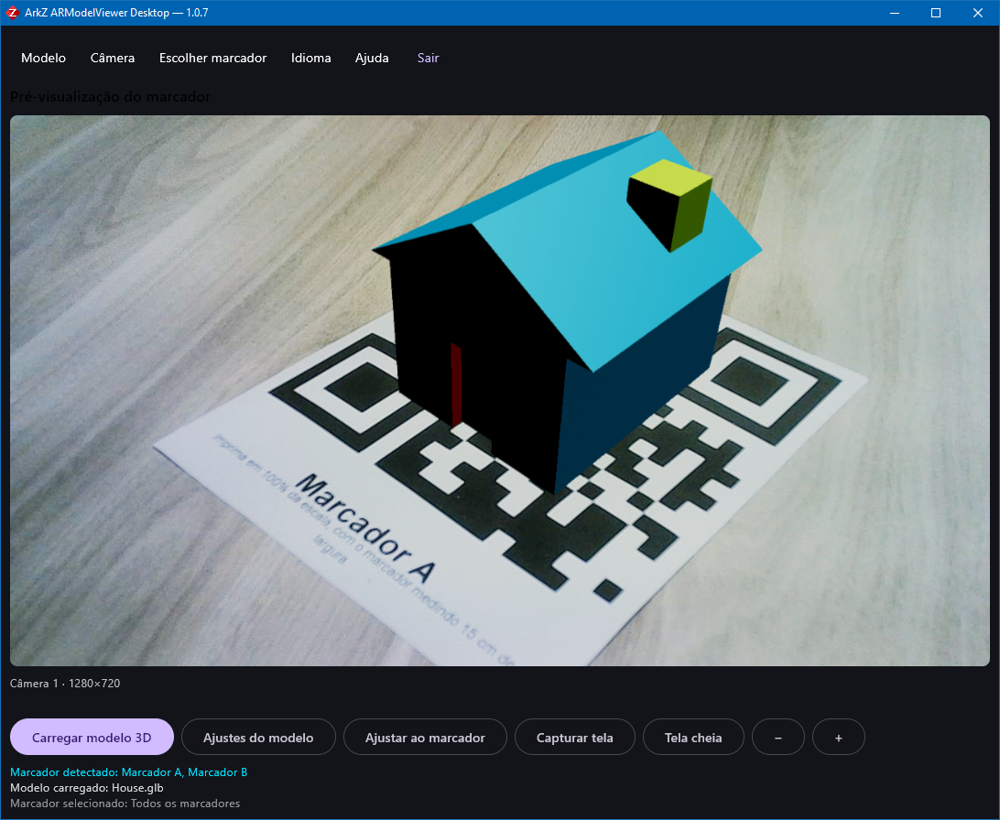
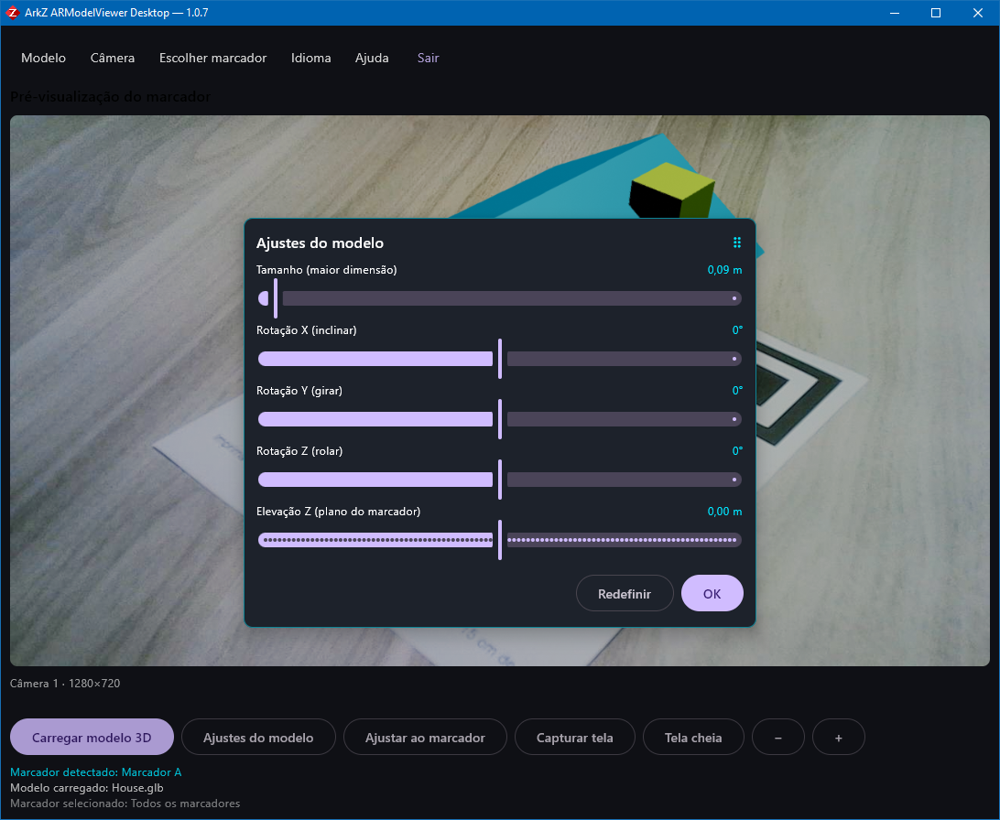
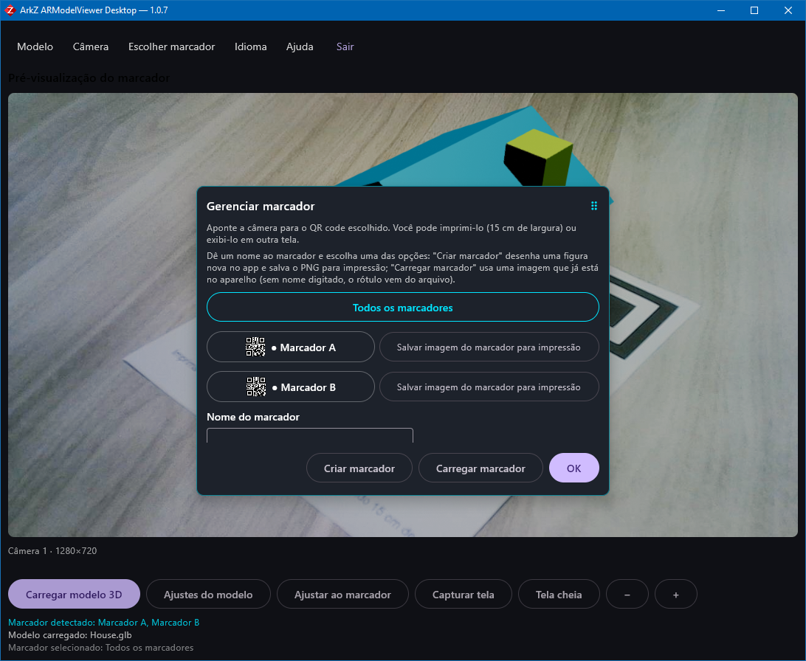

# ArkZ ARModelViewer Desktop

**Repositório:** <https://github.com/em-rezende/Windows-ArkZ-ARModelViewer> ·
**Licença:** [GPL-3.0](LICENSE) · **Autor:** Ark-Z Arquitetura Ltda ·
**Origem:** versão Windows do [Android-ArkZ-ARModelViewer](https://github.com/em-rezende/Android-ArkZ-ARModelViewer)

Visualizador de modelos 3D (`.glb`, `.gltf`, `.obj`, `.ply`, `.stl`, `.3mf`) em
**Realidade Aumentada ancorada em marcadores de imagem**, para **Windows 10/11**.
Carregue um modelo, aponte a webcam para uma figura impressa (QR code A/B ou um
marcador criado pelo próprio app) e o modelo fica fixo sobre ela.

* **Linguagem:** Kotlin (JVM)
* **Interface:** Compose for Desktop (Material 3) — a mesma API do Jetpack Compose do app Android
* **Renderização 3D:** [Filament](https://github.com/google/filament) pelo binding comunitário
  [`io.github.erkko68.filament`](https://github.com/Erkko68/filament-kmp) (FFM, JDK 22+)
* **Câmera + visão computacional:** [OpenCV via JavaCV/Bytedeco](https://github.com/bytedeco/javacv)
* **Conversão de formatos não-glTF:** [Assimp](https://github.com/assimp/assimp) pelo binding oficial do [LWJGL](https://www.lwjgl.org)

> **Estado atual: etapas 0 a 9 concluídas e conferidas em uso real** (webcam, marcador
> impresso e modelo ancorado, no notebook do cliente): o esqueleto, a lógica portável com
> i18n completo (8 idiomas, 116 chaves), a **câmera**, a **detecção de marcador com caixa
> ciano** (mesma interface do `AugmentedImage` do ARCore), a **ancoragem do modelo** (com a
> projeção derivada das intrínsecas da detecção e o **modelo em pé** sobre a figura), a
> **leitura dos seis formatos** (com conversão para GLB pelo Assimp), o **backend Filament**
> desenhando a cena fora da tela, a **barra de menus** completa (Modelo, Câmera, Marcador,
> Idioma, Ajuda, Sair), os **ajustes em tempo real** num diálogo arrastável (com o botão
> Redefinir), a **escala automática**, o **gerenciamento de marcador**, o **modo tela cheia**
> e o **zoom/arrasto** por roda, `Ctrl`+roda, teclado, botões `−`/`+`, pinça de touchpad e
> arrasto com o mouse, e o **instalador Windows** (`gradlew packageMsi`). **210 testes unitários
> verdes**, três deles conferindo os **pixels** de quadros desenhados na GPU. O pacote portátil, o
> instalador e o diagnóstico de modelo por linha de comando estão em
> [`docs/development.md`](docs/development.md); o roadmap completo, com critérios de
> aceite por etapa, em [`docs/roadmap.md`](docs/roadmap.md); a detecção em
> [`docs/marker-detection.md`](docs/marker-detection.md), a renderização em
> [`docs/rendering.md`](docs/rendering.md) e as mudanças de cada versão no
> [`CHANGELOG.md`](CHANGELOG.md).

## Capturas de tela

| Modelo ancorado no marcador | Ajustes do modelo | Gerenciar marcador |
|---|---|---|
|  |  |  |
| **A janela principal:** vídeo da webcam, caixa do marcador reconhecido, `House.glb` ancorado e a linha de estado com o modelo e o marcador carregados. | **Ajustes do modelo:** tamanho, rotação nos três eixos e elevação, com o botão *Redefinir*. | **Gerenciar marcador:** os marcadores embutidos, o salvamento da imagem para impressão e o marcador criado pelo usuário. |

As três são capturas reais do aplicativo **1.0.7**, na mesma máquina do teste em campo (webcam
integrada, folha impressa do **Marcador A** apoiada na mesa).

## Baixar e instalar

A versão publicada é a **[1.0.7](https://github.com/em-rezende/Windows-ArkZ-ARModelViewer/releases/tag/v1.0.7)**,
que traz dois anexos na página da release:

| Anexo | Para quem |
|---|---|
| `ArkZ.ARModelViewer-1.0.7.msi` | **Instalador** (recomendado): atalho no menu Iniciar e na área de trabalho, desinstalador em *Configurações › Aplicativos* e `upgradeUuid` fixo. Pede o *Visual C++ Redistributable 2015-2022* na máquina de destino. |
| `ArkZ-ARModelViewer-1.0.7-portatil.zip` | **Portátil**: descompacte e execute `ArkZ ARModelViewer.exe`. Não instala nada — o JRE e o runtime do C++ vão junto. |

O `.msi` não é assinado digitalmente, então o Windows avisa *"Editor desconhecido"*: é esperado (**Mais
informações › Executar assim mesmo**). Para compilar do código em vez de baixar, siga
[`docs/development.md`](docs/development.md).

## Requisitos

| Item | Versão |
|---|---|
| Windows | 10 ou 11 (x64) |
| JDK | **25** (toolchain do Gradle) — o Filament no desktop exige **Java 22+**, porque o binding usa FFM (Project Panama) |
| Gradle | 9.7.1 (vem pelo wrapper) |
| WiX Toolset | **nenhum a instalar** — o plugin do Compose baixa o WiX 3.11 sozinho na primeira vez que o `.msi` é gerado (`build/wix311`) |
| Visual C++ Redistributable | 2015-2022 — **só para quem instala pelo `.msi`**: o instalador monta a própria imagem e não leva as três DLLs que o pacote portátil leva ao lado do `.exe` |
| Webcam | integrada ou USB |

> O Gradle **baixa o JDK 25 sozinho** quando a máquina não tem a versão exata (veja
> `org.gradle.java.installations.auto-download` em `gradle.properties` e o
> `foojay-resolver-convention` em `settings.gradle.kts`). O
> `gradle/gradle-daemon-jvm.properties` pede Java 25 para o daemon do Gradle.

## Como compilar, testar e executar

```powershell
.\gradlew.bat compileKotlin     # compila
.\gradlew.bat test              # testes unitários (JUnit 5)
.\gradlew.bat run               # abre a janela do app
.\gradlew.bat -q listCameras    # lista as webcams (índices do OpenCV)
.\gradlew.bat packageMsi        # instalador .msi (o WiX vem na primeira vez)
```

O instalador sai em `build/compose/binaries/main/msi/`, com atalho no menu Iniciar,
desinstalador e `upgradeUuid` fixo (uma versão nova **atualiza** a instalação
anterior em vez de criar uma segunda entrada).

### Levar para outra máquina (notebook, outro computador)

Para testar em outro computador **não é preciso instalar nada nele** — nem Java. O comando

```
gradlew.bat createDistributable
```

monta uma pasta **autossuficiente** (com o JRE junto) em
`build\compose\binaries\main\app\ArkZ ARModelViewer\`. Copie a pasta inteira (compactada, ~258 MB)
para o outro computador e execute **`ArkZ ARModelViewer.exe`** dentro dela.

É portátil de propósito: não instala, não cria atalho e não mexe no registro. Também **não precisa de
nada instalado** — nem do WiX, que só o `.msi` usa e que o próprio Gradle baixa (etapa 8). Para
**desenvolver** no outro
computador, aí sim é preciso o JDK 25 e o `gradlew.bat run`.

É o caminho recomendado para testar num notebook com **touchpad e tela sensível ao toque**. Duas
observações do teste em campo (decisão 31 do roadmap): a pinça do **touchpad** chega ao aplicativo
como `Ctrl`+roda — o mesmo caminho da roda do mouse, que já estava confirmado; a pinça de **dois
dedos na tela sensível ao toque não funciona**, e não
por defeito do aplicativo — a camada de entrada do Compose Desktop no Windows recebe o toque já
convertido em mouse, de um contato só. Para ampliar o modelo na tela, use os botões **`−`** e **`+`**
(um dedo só), o cursor de "Tamanho" nos ajustes do modelo ou a "Escala automática".

#### Se um modelo não carregar lá

Há um diagnóstico pela linha de comando, que **não abre a janela** e grava um relatório em arquivo
(o pacote é um programa de janela, sem console, então um `println` não apareceria em lugar nenhum):

```
"ArkZ ARModelViewer.exe" --check-model "C:\caminho\do\modelo.obj"
```

O relatório fica em `%LOCALAPPDATA%\ArkZ ARModelViewer\logs\diagnostico-modelo.txt` — com o ambiente
(versões, pastas, presença do runtime do Visual C++) e o resultado da conversão, ou o motivo exato da
falha junto com o que fazer. O código de saída é `0` quando carrega e `1` quando falha. Vale saber
que a conversão grava o `.glb` **ao lado do arquivo escolhido** (é o comportamento normal do
aplicativo, não um efeito do diagnóstico). No desenvolvimento, o mesmo diagnóstico roda sem o pacote:

```
gradlew.bat modelCheck -Pmodelo="3d_models/ArkZ_logo.obj"
```

### O que já aparece na janela

Nome e versão lidos do Gradle, seletor com os 8 idiomas (a troca recompõe a
interface **na hora**), vídeo ao vivo da webcam com escolha de dispositivo, **a caixa
ciano sobre o marcador reconhecido** (com o rótulo e a distância em metros — o mesmo
feedback do cubo ciano do app Android, que indica que a detecção está funcionando), os
marcadores embutidos com largura física e o roadmap embutido. A pasta de capturas e de
marcadores (`Pictures/ArkZ ARModelViewer`) é a mesma do app Android.

Aponte o marcador **A** ou **B** impresso (15 cm de largura) para a webcam a 30–60 cm:
a caixa ciano aparece assim que a figura é reconhecida, e a barra de status mostra
"Marcador detectado: Marcador A — carregue um modelo 3D para exibi-lo" (o mesmo texto do
app Android, ainda sem modelo porque isso entra na etapa 4).

## Modelos 3D de exemplo (`3d_models/`)

Cinco arquivos versionados junto com o código — e **nenhum deles entra no aplicativo**: são os
modelos usados pelos testes que leem arquivo de verdade (`AssimpModelLoaderTest` e
`FilamentRendererTest`), os exemplos do diagnóstico por linha de comando
(`gradlew.bat modelCheck -Pmodelo=…`) e o `House.glb` é o modelo que aparece nas **capturas deste
README**. O `.gitattributes` os marca como **binários**, para a normalização de fim de linha nunca
corromper o conteúdo.

| Arquivo (o nome é o endereço de download) | Formato | Tamanho | SHA-256 |
|---|---|---|---|
| [`ArkZ_logo.glb`](https://raw.githubusercontent.com/em-rezende/Windows-ArkZ-ARModelViewer/main/3d_models/ArkZ_logo.glb) | glTF 2.0 binário | 65.628 bytes (64,09 KiB) | `493D580E1B7E27A20FD213D4BEC394A4C3C350E546569FA7B53EC99A9E5B8C74` |
| [`ArkZ_logo.obj`](https://raw.githubusercontent.com/em-rezende/Windows-ArkZ-ARModelViewer/main/3d_models/ArkZ_logo.obj) | Wavefront OBJ (texto) | 48.711 bytes (47,57 KiB) | `7015E67AF35161EE8B212CA78A1642576C17B89204EA15F83A20DFC123FB9A0C` |
| [`ArkZ_logo.ply`](https://raw.githubusercontent.com/em-rezende/Windows-ArkZ-ARModelViewer/main/3d_models/ArkZ_logo.ply) | PLY binário little-endian | 19.342 bytes (18,89 KiB) | `DB8332541307A8E265DE7EDDE3977A3C4B27759E597982AA9D40EED4F4CE3E5C` |
| [`ArkZ_logo.stl`](https://raw.githubusercontent.com/em-rezende/Windows-ArkZ-ARModelViewer/main/3d_models/ArkZ_logo.stl) | STL binário (1.498 triângulos) | 74.984 bytes (73,23 KiB) | `EB86C23EB72F595BD396E979ACB547096DFE8322265EA9F6517FB4EFFCE7FB83` |
| [`House.glb`](https://raw.githubusercontent.com/em-rezende/Windows-ArkZ-ARModelViewer/main/3d_models/House.glb) | glTF 2.0 binário | 7.704 bytes (7,52 KiB) | `596B44540C08E75BDFF269454A182C28694FF44BDC7450A3833934BE40A8EDB1` |

O logotipo está nas **quatro extensões** do mesmo modelo (exportado do Blender): é com ele que a
suíte confere que a conversão pelo **Assimp** entrega a **mesma medida** em `.obj`, `.ply` e `.stl`,
e que um `.glb` carrega **direto**, sem conversão. O `House.glb` é a **casa de referência** dos
testes de GPU — **5,0 × 4,5 × 5,0** unidades, com o chão em `y = 0`, o telhado no topo do **Y** e a
porta vermelha na face do **+Z** (a que a correspondência de eixos leva para a normal, virada para
quem olha). É essa medida que a decisão 38 usa e é ela que o teste de GPU cobra em **pixel**.

Os endereços de download têm todos a **mesma base** — `/main/3d_models/` — com o nome do arquivo (o
link da tabela) no fim, então dá para baixar a pasta inteira de uma vez e conferir cada hash com o
`Get-FileHash`, que é quem produz a coluna SHA-256 da tabela:

```powershell
$modelos = "ArkZ_logo.glb", "ArkZ_logo.obj", "ArkZ_logo.ply", "ArkZ_logo.stl", "House.glb"
$base = "https://raw.githubusercontent.com/em-rezende/Windows-ArkZ-ARModelViewer/main/3d_models"
foreach ($modelo in $modelos) { Invoke-WebRequest "$base/$modelo" -OutFile $modelo }

Get-FileHash .\House.glb -Algorithm SHA256   # 596B4454…0A8EDB1
```

> A pasta também trazia o `Edificio.glb` (o prédio de 1.358.704 bytes): esteve no repositório da
> **1.0.0** à **1.0.6** e saiu na **1.0.7**. Nenhum teste, documento ou captura apontava para ele —
> quem faz o papel de modelo de referência é o `House.glb`, de 7,5 KiB.

---

## Decisões técnicas (e o que foi verificado)

### 1. SceneView não existe para desktop — reaproveitamos as convenções, não o código

No Maven Central, `io.github.sceneview:sceneview` e `:arsceneview` (4.38.0) são
publicados **apenas como AAR Android**. Existe
`io.github.sceneview:sceneview-compose-desktop:4.38.0`, mas o próprio projeto o
descreve como *"viewer subset only — No AR, no custom materials, no
post-processing"*, e a página oficial de plataformas classifica **Desktop** como
*"Placeholder"*. Não há caminho para montar uma cena de RA (câmera + pose do
marcador) sobre essa fachada.

**O que foi portado do SceneView Android, então:** a arquitetura que dá o
comportamento reconhecível — `MarkerDefinition`/`MarkerCatalog`, `ModelMetrics`
(normalização e ancoragem em unidades cruas do arquivo), o painel de ajustes com os
mesmos limites (tamanho padrão 20 cm, faixa 0,02–2,0 m; rotação 0°/0°/0°; elevação
Z −50…+50 cm em passos de 1 cm), a barra de ferramentas, o menu ⋮, os tempos das
mensagens de status, a folha de impressão e as convenções de referencial do
`AugmentedImage` (+X largura, +Y normal, +Z altura na imagem).

### 2. Filament: sem suporte oficial a desktop — usamos o binding comunitário

O Google **removeu o suporte Java/desktop em 2021**
([google/filament#4263](https://github.com/google/filament/pull/4263)): os
arquivos de release trazem apenas bibliotecas C++ e ferramentas nativas, o JNI
desktop só é compilado no build Android e o pedido de suporte KMP desktop foi
fechado como *not planned*
([#7558](https://github.com/google/filament/issues/7558)).

A única fonte mantida é o **filament-kmp** ([Erkko68](https://github.com/Erkko68/filament-kmp),
Apache-2.0, 0.5.0, Filament 1.76), que expõe a API de baixo nível (`Engine`,
`Renderer`, `SwapChain`, `View`, `Camera`, `TransformManager`, `gltfio`) para
Desktop/JVM via FFM e publica os nativos por plataforma — incluindo
`filament-ffm-runtime-windows-x64`, confirmado na resolução deste projeto.

Essa escolha **deixou de ser uma aposta**: o teste `FilamentSpikeTest` cria o motor
gráfico, uma cena, uma câmera e um `SwapChain` **offscreen** e desenha um quadro de
256×256 — e passa nesta máquina, sem janela e sem interface. Dois detalhes que só
apareceram ao inspecionar os artefatos, e que evitam becos sem saída:

* os jars **não trazem nenhum material `.filamat`** — os materiais do aplicativo são
  compilados **em tempo de execução** pelo módulo `filamat` (`MaterialBuilder`) do
  próprio binding, sem asset externo e sem depender do `matc`;
* os *uber shaders* do `gltfio` vêm **embutidos na biblioteca nativa**
  (`UbershaderProvider(engine)`), então ler `.glb`/`.gltf` também não exige arquivo de
  apoio.

### 3. Formatos que o Filament não lê passam pelo Assimp

O Filament lê glTF/GLB. No Android, o SceneView converte `.obj`, `.stl`, `.ply` e
`.3mf` para GLB em Kotlin puro (em milímetros, material cinza). Aqui a conversão é
feita pelo **Assimp** (`org.lwjgl:lwjgl-assimp:3.3.6`, binding oficial, com
`natives-windows`), produzindo o mesmo resultado observável: o `.glb` é gravado **ao
lado** do arquivo preparado, com o mesmo nome.

Duas flags fazem o trabalho pesado e cada uma responde por um defeito clássico:

* `aiProcess_PreTransformVertices` — as transformações dos nós já vêm aplicadas nos
  vértices, o que dá uma caixa envolvente correta **no referencial do arquivo** sem
  compor matrizes de nó;
* `aiProcess_GenBoundingBoxes` — **sem ela a caixa vem zerada**. O sintoma dessa
  omissão é o pior possível: o modelo carrega e **não aparece**, porque a normalização
  de tamanho vira 1 e o modelo fica com o tamanho em unidades cruas (um modelo em
  milímetros vira 1000 m). O teste com o mesmo logo em `.obj`, `.stl` e `.ply` confere
  que as três leituras dão a mesma medida.

### 4. Câmera: OpenCV (`opencv_videoio`), não `webcam-capture`

`com.github.sarxos:webcam-capture` parou em **0.3.12 (2018)** e depende de drivers
descontinuados. O OpenCV via Bytedeco (`org.bytedeco:opencv:4.14.0-1.5.14`, com o
classificador `windows-x86_64`) resolve **captura e visão computacional na mesma
dependência**: `VideoCapture` com backend MSMF (DShow como alternativa),
`features2d`/`calib3d` para a detecção e `imgproc` para as conversões.

### 5. Detecção de marcador: camada própria, com a interface do ARCore

O ARCore é exclusivo do Android, então a detecção é implementada aqui com
**ORB + `BFMatcher` (Hamming) + homografia (RANSAC) + `solvePnP` (IPPE)**, usando a
largura física conhecida do marcador (0,15 m padrão). O `BFMatcher` foi escolhido no
lugar do FLANN porque, com poucos marcadores, a busca exaustiva é mais previsível: não
exige ajuste de LSH e devolve sempre o mesmo resultado (o que também torna os testes
determinísticos).

O módulo expõe a **mesma interface** do `AugmentedImage` (`id`/`name`, `centerPose`,
`extentX`, `extentZ`, `trackingState`, `trackingMethod`, `index`), de modo que a lógica
da tela de RA é portada quase sem alteração — incluindo o `PAUSED` com
"última pose conhecida" e o `distinctByPose`. Há também um caminho opcional por
**ArUco** (`opencv_aruco`, presente no build do Bytedeco) para quem preferir marcadores
ArUco/AprilTag; o padrão continua sendo o casamento de pontos de interesse, que é o que
faz os marcadores já impressos continuarem valendo.

Como o matching de features é o que o ARCore faz com *augmented images*, os
**mesmos marcadores já impressos continuam valendo** — inclusive os pseudo-QR
gerados pelo app, que são idênticos aos do Android (o gerador usa
`kotlin.random.Random(seed = label.hashCode())`, e o `hashCode` de String do Java é
estável entre plataformas).

Detalhes do caminho, das limitações e dos ajustes finos:
[`docs/marker-detection.md`](docs/marker-detection.md).

### 6. Ícones da interface

`org.jetbrains.compose.material:material-icons-extended` parou na 1.7.3 e não
existe para a linha 1.9/1.12 usada aqui. Os ícones da barra (Reiniciar, QR code,
Ajustes, Escala automática, Capturar, Sair, ⋮, remover) são `ImageVector`s próprios,
com os mesmos desenhos do Material Design — sem dependência extra e sem risco de
conflito de versão.

---

## Toque, touchpad e mouse

O aplicativo funciona com mouse, touchpad e tela sensível ao toque, mas **não é igual nos
três** — e a diferença não está no aplicativo, está no que o Windows entrega:

| Entrada | O que funciona |
|---|---|
| Mouse | zoom pela **roda** e por `Ctrl`+roda, arrasto do modelo com o **botão esquerdo**, `+`/`-` no teclado e os botões `−`/`+` da barra |
| Touchpad | tudo do mouse e, além disso, a **pinça de dois dedos** (o Windows a entrega ao aplicativo como `Ctrl`+roda) |
| Tela sensível ao toque | os **botões `−`/`+`**, o cursor de **Tamanho** nos ajustes e a **Escala automática**; o arrasto do modelo funciona com **um dedo** (que o Windows entrega como mouse) |

A **pinça de dois dedos na tela sensível ao toque não funciona** — e não é defeito deste
aplicativo: a camada de entrada do Compose Desktop no Windows **não recebe eventos de
toque** (nem o `skiko-awt-0.150.1` nem o `ui-desktop-1.12.0` têm `TouchListener`,
`TouchEvent` ou `onTouch`), e o toque chega convertido em mouse, **de um contato só**. É por
isso que o arrasto de um dedo funciona e a pinça não: a pinça entrega **um** ponteiro ao
gesto, o fator de zoom fica sempre em `1f` e nada acontece. O gesto continua no código
porque é a implementação correta e passaria a valer no dia em que a plataforma entregar
toque. O aplicativo grava no log quantos pontos estão em contato com o vídeo
(`Pontos em contato com o video: 1 (Mouse).`), sempre que isso muda — se algum dia
aparecer `2 (Touch)`, a pinça passou a funcionar.

O histórico da investigação está na **decisão 31** de
[`docs/roadmap.md`](docs/roadmap.md), e o caminho do gesto no código, em
[`docs/rendering.md`](docs/rendering.md).

## Estrutura do projeto

```
Windows - ArkZ ARModelViewer/
├── build.gradle.kts              # Compose Desktop, deps, versão gerada a partir do build, .msi
├── settings.gradle.kts           # repositórios + toolchain (foojay)
├── gradle.properties             # memória do daemon, auto-download de JDK
├── gradle/libs.versions.toml     # catálogo de versões (Kotlin, Compose, Filament, OpenCV, LWJGL)
├── gradle/gradle-daemon-jvm.properties
├── src/main/kotlin/com/arkz/armodelviewer/
│   ├── Main.kt                   # janela + tema (equivalente à MainActivity)
│   ├── markers/MarkerCatalog.kt  # marcadores embutidos + ARGB (equivalente ao do Android)
│   ├── ui/ArSceneSection.kt      # a tela de RA (menus + vídeo + painel + rodapé)
│   ├── ui/ArMenuBar.kt           # os seis menus e os itens como dados
│   ├── ui/ArDialogs.kt           # ajuda, sobre, qualidade, marcadores, criar marcador
│   └── util/AppLinks.kt · Images.kt
├── src/main/resources/
│   ├── augmented_images/         # marker_a.png, marker_b.png (os mesmos do Android)
│   ├── i18n/                     # 8 bundles .properties (gerados por tools/)
│   └── icons/
├── src/test/kotlin/…             # JUnit 5 (i18n, marcadores, informações do app)
├── 3d_models/                    # 5 modelos de exemplo: o logotipo em .glb/.obj/.ply/.stl e o House.glb
├── assets/                       # as capturas de tela usadas neste README
├── docs/                         # roadmap, idiomas, desenvolvimento
├── tools/                        # scripts PowerShell (assets, idiomas, câmeras…)
├── LICENSE · NOTICE              # GPL-3.0 + licenças de terceiros
└── README.md
```

## Mapa de portabilidade (Android → Windows)

| Android | Windows | Observação |
|---|---|---|
| `MainActivity` (+ permissão de câmera) | `Main.kt` | Não há permissão de câmera a pedir; a webcam ausente/ocupada vira tela de estado. |
| `MarkerCatalog` / `MarkerDefinition` | idem (`markers/MarkerCatalog.kt`) | `Bitmap` ARGB_8888 → `BufferedImage` `TYPE_INT_ARGB`. |
| `MarkerGenerator`, `CustomMarkerStore`, `ModelMetrics`, `ModelLoadState`, `MarkerPrintSheet`, `GallerySaver`, `AppPreferences`, `AppLinks` | mesmos nomes | Lógica portada; `SharedPreferences` → `preferences.properties`, galeria → `Pictures/ArkZ ARModelViewer`, `Intent` → `Desktop`. |
| `AppLocale` + `values-*/strings.xml` | `ui/AppLocale.kt` + `i18n/*.properties` | Mesmos 8 idiomas + "Sistema"; divergências explícitas em `tools/i18n-overrides/` (veja [`docs/i18n-parity.md`](docs/i18n-parity.md)). |
| `ARSceneView` (ARCore + Filament) | `ar/` (detecção própria) + `render/` (Filament) | ARCore → OpenCV; Filament continua sendo o renderizador. |
| `ScreenCapture` (espelhamento da cena) | render offscreen | A interface do Compose nunca entra na imagem, como no Android. |
| `SurfaceMirrorer`, permissões, MediaStore | — | Sem equivalente necessário. |

## Idiomas

pt-BR (padrão), pt-PT, en, es, fr, de, it e zh-CN, com troca em tempo de execução
pelo menu ⋮ → **Idioma** (mais a opção "Sistema", que segue o idioma do Windows).
Os textos vêm do app Android e são convertidos por script; o pipeline, a paridade
de chaves e as divergências de plataforma estão documentados em
[`docs/i18n-parity.md`](docs/i18n-parity.md).

## Licença e créditos

Distribuído sob a **GNU General Public License v3.0** — veja [LICENSE](LICENSE).
Copyright (C) 2026 Ark-Z Arquitetura Ltda · Desenvolvedor: **Ezequiel M. Rezende** ·
<https://em-rezende.github.io/> · emrezende@gmail.com

As bibliotecas de terceiros mantêm as suas próprias licenças (Apache-2.0 para
Filament, filament-kmp, Compose/Kotlin, OpenCV e JavaCV; BSD-3 para LWJGL e
Assimp) — a lista completa está em [NOTICE](NOTICE).
